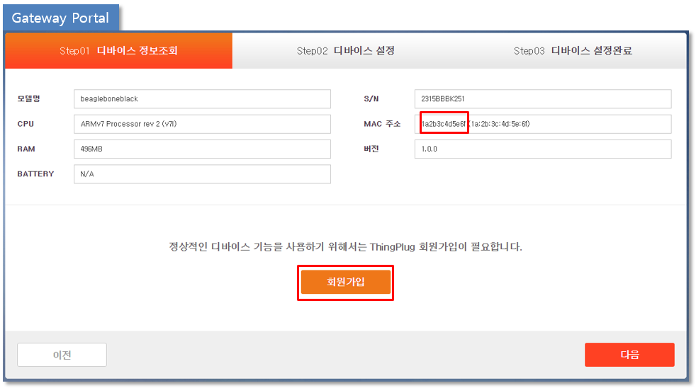
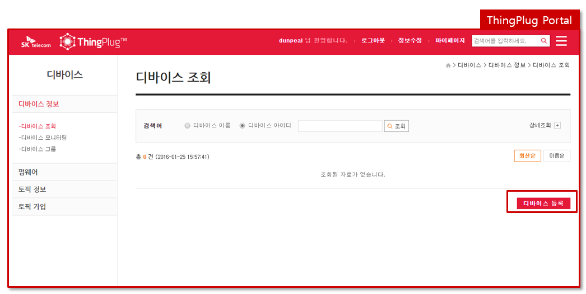
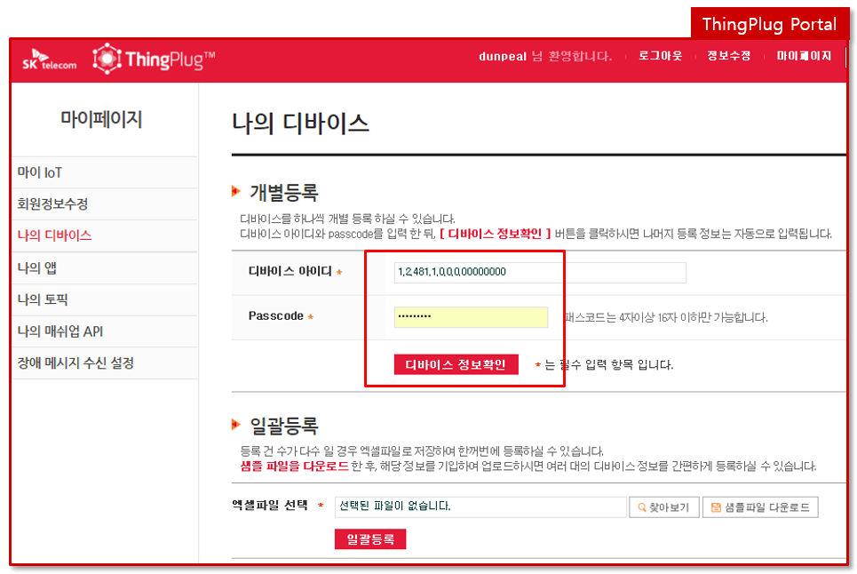
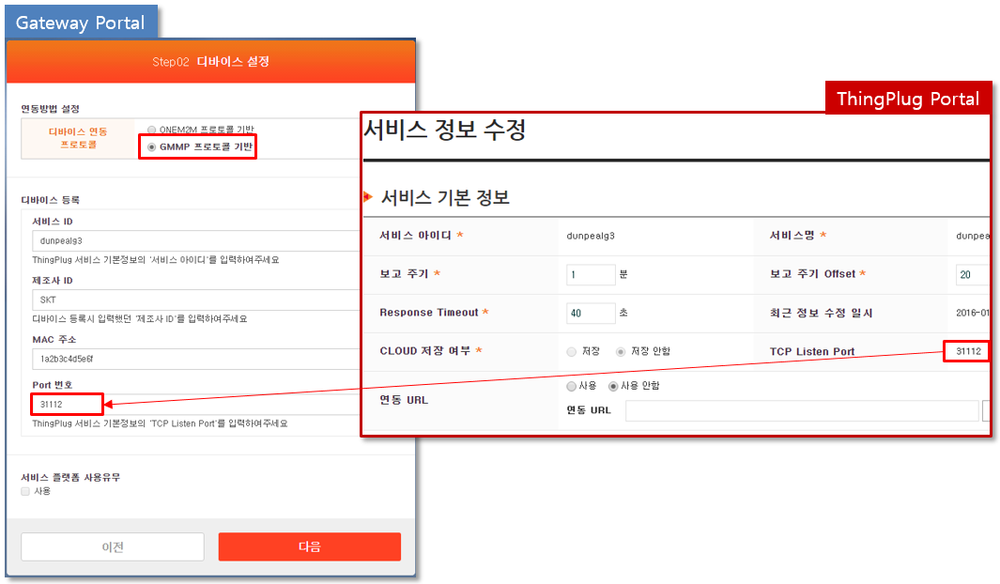
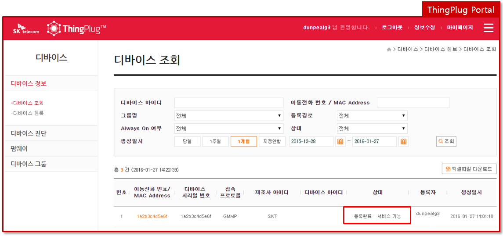
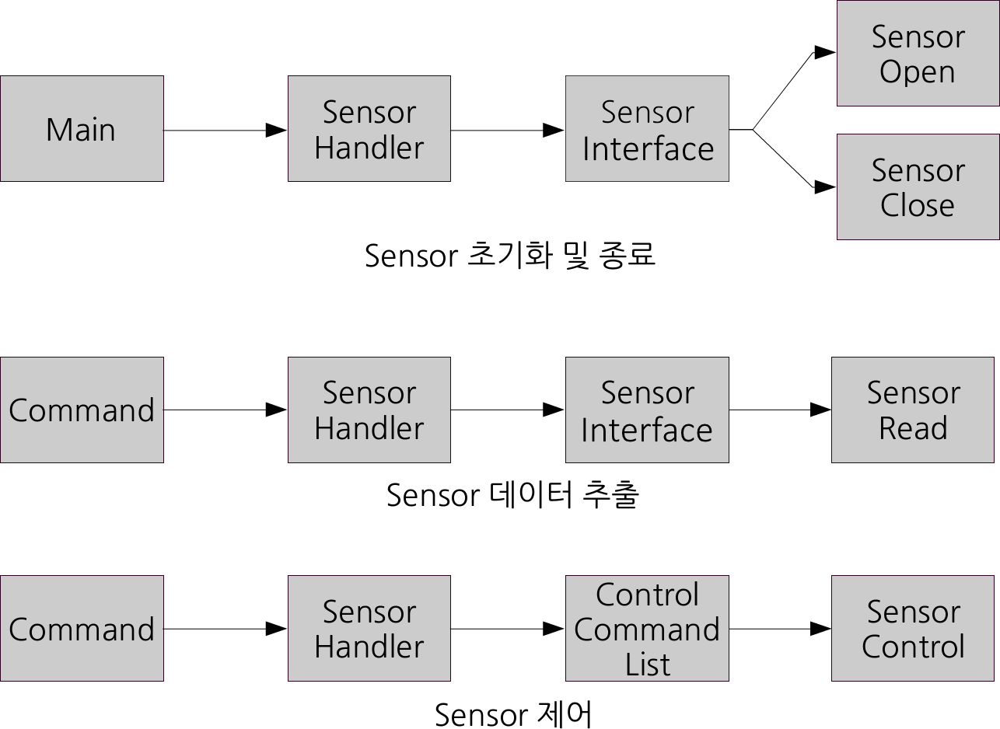
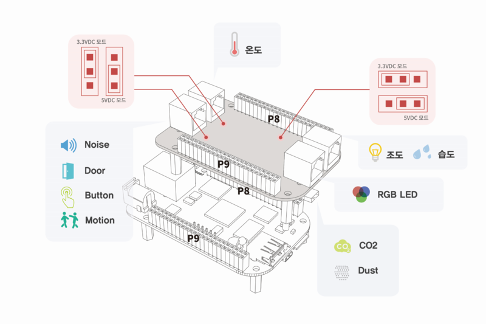

#### 2016년 3월 10일 - Version: 0.9.0

## ThingPlug를 위한 Device 미들웨어 설치 및 실행가이드
본 챕터는 SKT ThingPlug Device 미들웨어 설치 및 실행 방법을 서술한다.

#### 1. 환경 설정

0. 윈도우 사용자의 경우 아래의 URL 에서 putty 를 다운받아 설치한다.
	* http://www.chiark.greenend.org.uk/~sgtatham/putty/download.html
1. 인터넷 연결을 위하여 Ethernet(LAN 케이블)이나 Wi-Fi USB 동글을 장치에 연결한다.
2. 터미널(윈도우 PC에서는 putty)을 열고 각 장치 환경에 따라 네트워크 환경을 설정한다.
3. 처음 실행하는 장치를 업데이트 및 업그레이드 한다.

	```
	# apt-get update
	# apt-get upgrade
	```

#### 2. 미들웨어에서 사용하는 Library 안내
미들웨어에서 사용하는 Library 들은 다음과 같다.
<table>
<thead><tr><th>Part</th><th>Library</th><th>Type</th><th>용도</th></tr></thead>
<tbody>
<tr><td rowspan="7">Gateway Portal</td><td>express</td><td>패키지 포함</td><td>프레임워크</td></tr>
<tr><td>express-session</td><td>패키지 포함</td><td>Express 에 Session 추가</td></tr>
<tr><td>body-parser</td><td>패키지 포함</td><td>Express 에 BodyParser 추가</td></tr>
<tr><td>request</td><td>패키지 포함</td><td>http request 전송</td></tr>
<tr><td>xml2js</td><td>패키지 포함</td><td>XML 파싱</td></tr>
<tr><td>ping</td><td>패키지 포함</td><td>Ping 체크</td></tr>
<tr><td>i18n</td><td>패키지 포함</td><td>다국어 지원</td></tr>
<tr><td rowspan="4">Management Agent</td><td>libcurl</td><td>패키지 포함</td><td>HTTP 통신</td></tr>
<tr><td>libmosquitto</td><td>패키지 포함</td><td>MQTT 통신</td></tr>
<tr><td>libxml2</td><td>shared</td><td>XML 데이터 처리</td></tr>
<tr><td>libsqlite3</td><td>shared</td><td>데이터 저장</td></tr>
<tr><td rowspan="2">공용</td><td>libsodium</td><td>shared</td><td>IPC 통신</td></tr>
<tr><td>lizeromq</td><td>shared</td><td>IPC 통신</td></tr>
</tbody>
</table>

#### 3. 패키지 설치
0. 데비안 패키지 파일을 다운로드 한다.

	```
	# wget https://[TBD]
	```

1. 데비안 패키지를 설치한다.(반드시 root 계정을 이용해야 한다.)	

	* 일반적으로 dpkg 명령을 통하여 패키지를 설치한다.
	```
	# dpkg -i devicemiddleware_arm_1.0.0_20160301.deb
	```
	* Library dependencies 등의 문제가 발생할 경우 gdebi 를 이용하여 패키지를 설치한다.
	```
	# apt-get install gdebi
	# gdebi devicemiddleware_arm_1.0.0_20160301.deb
	```

#### 4. 패키지 설치 확인
브라우저에서 http://IP-address:8000 번으로 접속하여 다음과 같은 화면(Gateway Portal)이 나오면 모든 설치가 완료된 것이다.  

(로그인 화면에서 아이디 / 비밀번호 : thingplugadmin / adminthingplug)

#### 5. 사용 방법
0. 정지

	```
	# service middleware stop
	```

1. 시작

	```
	# service middleware start
	```

2. 재시작

	```
	# service middleware restart
	```

3. 구동 확인

	```
	# ps xl | grep middleware
	```

4. 제거
	* usr/local/middleware 내부의 모든 파일이 삭제되니 필요한 경우 백업이 필요함

	```
	# dpkg -r devicemiddleware
	```
	
5. UART5/HDMI 형식의 센서 사용법
	* BeagleboneBlack에서 HDMI 포트와 UART포트가 겹치는 현상이 있어 둘중에 하나만 사용이 가능하다.
	* 미들웨어 설치시 HDMI포트 자동으로 Disable하고 UART를 Enable 하기 때문에, HDMI를 다시 사용 할 경우 다음과 같은 절차를 따른다.
	```
	# dpkg -r devicemiddleware
	# vi /boot/uEnv.txt

	##Disable HDMI (v3.8.x)
	#cape_disable=capemgr.disable_partno=BB-BONELT-HDMI,BB-BONELT-HDMIN
	```
	(cape_disable 앞에 # 을 추가한 후 reboot 명령어로 재시작하면 HDMI 포트 사용이 가능해짐과 동시에 UART 사용 불가)

----------
## ThingPlug Device 미들웨어 사용자를 위한 디바이스 등록 가이드
본 챕터는 Device를 oneM2M/GMMP 방식으로 등록하는 방법을 서술한다.

#### 1. SKT ThingPlug 회원 가입
0. thingplug.sktiot.com 접속
1. oneM2M/GMMP 구분은 디바이스 연동 프로토콜 선택을 통하여 구분한다.


#### 2. Gateway Portal 간편 세팅
0. 브라우저에서 http://IP-address:8000 번으로 접속하여 로그인 한다.
1. 로그인 화면에서 아이디 / 비밀번호 : thingplugadmin / adminthingplug

#### 3. Gateway Portal 정보 확인 
0. 모델명, CPU, S/N, MAC 주소 등을 확인할 수 있다.
1. MAC 주소 정보는 GMMP Gateway 등록시 필요한 정보이니 copy 해두자.
2. 회원가입 버튼을 통하여 ThingPlug Portal로 이동 가능하다.


#### 4. oneM2M 등록
*  ThingPlug 회원정보는 ThingPlug Portal 에서 oneM2M 으로 회원가입한 계정정보를 입력 후 정보확인 버튼을 클릭하여 확인 한다.(필수)


* 발급받은 디바이스 ID(OID) 와 디바이스 패스코드 를 입력한다.
* ThingPlug Portal 메뉴 > 개발자 지원 > OID 안내 내용을 참고한다.


* 서비스 플랫폼 사용유무는 ThingPlug 회원가입시 설정대로 처리한다.

	
* 등록이 정상적으로 완료되면 Step03 디바이스 설정완료 로 이동된다.
* 서비스 시작하기를 클릭한다.

	
* thingplug.sktiot.com 접속
* 디바이스 등록을 클릭한다.


* 장치 등록시 사용된 OID(디바이스 ID) 와 Passcode 입력 후 디바이스 정보 확인을 한다.


* 인증 성공 팝업이 발생하면 확인 후 필수 정보 입력을 진행하고, 저장하여 등록을 마무리한다.


* 등록이 성공한 디바이스는 마이페이지 > 마이 IoT 메뉴에서 아래와 같이 확인이 가능하다.


#### 5. GMMP 등록
* thingplug.sktiot.com 접속
* 디바이스 개별등록 메뉴를 통하여 등록을 진행한다.


* MAC 주소는 Gateway Portal > 간편세팅의 MAC 주소 정보를 Copy 해서 입력한다.


* 기본 정보와 통신 규격의 필수정보는 모두 입력 후 등록 요청한다.


* 승인완료-단말 Regi. 필요 로 표시되면 Gateway Portal 을 통한 단말 Registration이 가능하다.


* ThingPlug Portal 에서 등록시 사용한 정보를 카피하여 Registration 을 진행한다.


* ThingPlug Portal 마이페이지 > 서비스 정보수정 에서 TCP Listen Port 정보를 카피하여 Registration 을 진행한다.


* Registration 이 정상적으로 완료되면 Step03 으로 이동된다.
* 서비스 시작하기를 클릭한다.


* ThingPlug Portal 에서 등록완료-서비스 가능 문구를 확인한다.


#### 6. oneM2M-SP1 연동
* ThingPlug Portal 에 디바이스 등록이 완료된 후 진행한다.
* openhw.sp1.sktiot.com/ 접속 및 로그인 후 게이트웨이 등록을 진행한다.


* 게이트웨이 모델을 선택한다.


* 나머지 입력란은 아래 예시에 맞추어 입력해 준다.


* 센서 추가는 아래와 같이 Gateway Portal 의 센서정보를 참고하여 추가한다.
* 입력이 완료되면 게이트웨이, 디바이스, 센서 등록 진행 버튼을 통하여 등록을 완료한다.


* 등록이 완료되면 게이트웨이 관리 메뉴에서 확인이 가능하다.


* 대시보드에 게이트웨이/센서/액츄에이터를 다음과 같은 과정으로 추가해준다.


----------
# Sensor Management Agent Overview & Source

본 챕터는 Sensor 와 Actuator 조회 및 제어를 담당하는 **Sensor Management Agent**(SMA) 에 대한 소개와 직접 수정을위한 가이드를 제공한다.

### 1. 개요
SMA 는 Sensor 들을 관리하고, 데이터를 수집한다.
다양한 센서 입/출력을 처리하기 위한 Common Interface 로 개발하였다. 

### 2. 프로세스 흐름

> **Service Ready Agent**(SRA) 는 SMA 로 부터 센서 관련 정보들을 전달받아, 센서별 정책에 따라 데이터를 가공하는 등의 역할을 하는 Agent 이다.

* SMA 는 IPC Handler를 통하여 SRA 로부터 전달되는 Packet을 수신한다.
* **IPC Handler**는 수신된 Packet 을 Receive Command Queue 에 Push 한다.
* **Command Queue** 는 처리해야 할 Command 가 있는지 확인 한 후, 처리해야 할 Command가 있음을 Command Executer 에게 알린다.
* **Command Executer** 는 Packet Header 를 분석하여, 수행할 Command 인 경우 각 Command Process 에 수신된 Packet 을 전달하여 Command 처리를 요청한다.
* **Command Process** 는 수신된 Packet 을 Extractor 를 통해 분석된 내용을 구조화하고, 구조화된 정보를 이용하여 Command 를 처리한다.
* Command 를 처리할 때 만약 센서 관련 처리가 필요하다면, 이를 **Sensor Handler** 를 통해 수행한다.
* **Sensor Handler** 에서는 처리가 필요한 센서를 찾고, 해당 센서에 대응되는 **Sensor Interface** 를 찾아 실행시키고, 그에 대한 결과값을 리턴한다. 결과값을 바탕으로 Command 를 처리하며, 이 후 Generator를 이용하여 Send Packet을 구성하여 **Command Executer** 에 전달한다.
* **Command Executer** 는 Send Packet 을 Command Queue 에 Push 한다. IPC Handler 는 SRA 로 보낼 Packet 인 경우 Packet을 전송한다.

### 3. 센서 관리 전체 구조도
아래 그림은 센서제어를 위한 모듈의 전체 구조도이다.


#### 3.1. Sensor Handler
* **Sensor Handler** 모듈은 센서 관리의 핵심 역활을 수행한다. 등록된 센서의 초기화, 제어, 데이터 추출, 종료 함수를 관리 및 실행한다.
* **Sensor Interface** 에는 센서 관련 함수가 모여있으며, 각 센서별로 하나의 file 을 갖는다.
* 초기화 시 모든 센서의 초기화 함수를 실행한다.
* 센서의 초기화 함수에서는 자신의 제어명령이 있을 경우, 제어함수를 Control Command List 에 등록한다.
* 각 센서의 초기화가 완료되면, 주기적으로 센서값을 읽는 함수를 알람 시그널에 등록한다.
* 주기적으로 읽는 데이터는 **Configuration** 에 update 된다.
* Command 에 따라 센서 제어가 필요할 경우, **Control Command List** 에서 일치하는 제어함수를 실행한다.
* 주기적으로 해당 센서가 정상동작하는지 확인한다.
* 프로세스가 종료될 때 모든 센서의 종료 함수를 실행한다.

#### 3.2. Sensor Configuration
* Sensor Configuration 은 SMA 에서 동작할 센서에 대한 설정값을 저장한다.
* 관련 코드는 `/usr/local/middleware/SMA/source/configuration/SensorConfiguration.c` 파일에 있으며,
`/usr/local/middleware/conf/SMADeviceConf.backup` 파일이 존재하면 **SMADeviceConf.backup** 파일의 정보로 로딩된다.
* 사용자가 관리하고자 하는 센서목록을 정하고, 이를 Sensor Configuration 에 반영하는 작업은 필수이다.
* 설정 값을 정리하면 다음과 같다.

  * DeviceID : SMA에서 자동으로 세팅하여 사용하기 때문에 필드에 존재하지만 거의 사용하지 않는다.
  * SensorID : 센서를 구분하는 기준값이다. 10자리로 구현되어 있으며 숫자로 되어 있다. 중복되는 값이 들어가지 않도록 한다. (예)0000000001,000000002
  * SensorName : Sensor의 모델명이다. (예) DS18B20, CM1001
  * SensorType : Sensor의 종류를 나타낸다. (예) 온도, 습도
  * EnableFlag : 장치가 활성되었는지 여부.
  * ReadInterval : 센서를 읽는 주기 (초)
  * ReadMode : 센서를 읽는 방식 (예) polling, request, event
  * LastValue : Sensor의 마지막 데이터
  * StartTime : 데이터에 변화가 있는 시점
  * EndTime : 데이터에 변화가 없는 시점
  * SerialNumber : 센서의 시리얼 넘버
  * OperationType : 센서 구동 타입 (예) active, passive
  * MaxInterval : 데이터 변화 없어도 허용되는 최대 시간(초)
  * ControlType : SP1 Control Type 여부
  * RegisterFlag : SMA->SRA->MA로 센서를 등록 할지 여부

* **SENSOR_CONFIGURATION_T** 구조체 구성표
<table>
<thead><tr><th>구조체 멤버</th><th>변수 타입</th><th>기타</th></tr></thead>
<tbody>
<tr><td>DeviceID</td><td>String</td><td>최대길이 32byte</td></tr>
<tr><td>SensorID</td><td>String</td><td>최대길이 32byte</td></tr>
<tr><td>SensorName</td><td>String</td><td>최대길이 64byte</td></tr>
<tr><td>SensorType</td><td>String</td><td>최대길이 32byte</td></tr>
<tr><td>EnableFlag</td><td>Enum</td><td>SENSOR_STATE_DISABLE = 0<br>SENSOR_STATE_ENABLE = 1</td></tr>
<tr><td>ReadInterval</td><td>Int</td><td>seconds</td></tr>
<tr><td>ReadMode</td><td>Enum</td><td>SENSOR_MODE_POLLING = 0<br>SENSOR_MODE_REQUEST = 1<br>SENSOR_MODE_EVENT = 2</td></tr>
<tr><td>LastValue</td><td>String</td><td>MAX_LEN_LAST_VALUE = 32</td></tr>
<tr><td>StartTime</td><td>Int</td><td></td></tr>
<tr><td>EndTime</td><td>Int</td><td></td></tr>
<tr><td>SerialNumber</td><td>String</td><td>MAX_LEN_SERIAL_NUMBER=64</td></tr>
<tr><td>OperationType</td><td>Enum</td><td>SENSOR_ACTIVE_TYPE: 0x0001<br>SENSOR_PASSIVE_TYPE:0x0002</td></tr>
<tr><td>MaxInterval</td><td>Int</td><td>Value < 0 은 경우 on/off 판단불가<br>양수일 경우 시간만큼 Sensor Data 변화 없을 시 off 로 전환</td></tr>
<tr><td>ControlType</td><td>Int</td><td>1 = SP1 Control Type<br>2 = No SP1 Control Type</td></tr>
<tr><td>RegisterFlag</td><td>Int</td><td>0 = MA에 등록하지 않음<br>1 = MA에등록<br>값이 0이면장치에 센서가 연결되어 동작하더라도 MA에는등록하지 않음</td></tr>
</tbody>
</table>

#### 3.3. Sensor Interface
* 센서에 직접적으로 작동하는 함수를 모아놓은 파일이다. 
* 각 센서별로 하나의 파일이 존재하며, 내부적으로 초기화 함수, 제어 함수, 데이터 추출 함수, 종료 함수가 구현된다.
* 구현된 함수를 Sensor Handler 에 등록한다.

#### 3.4. Control Command List
* 센서의 제어명령들을 관리하는 리스트이다.
* 링크 리스트로 구현되어 있으며, Sensor Interface 의 제어명령에 대한 함수명과 함수포인터를 저장하고 있다.
* 제어 명령이 도착하면, 함수명을 확인하고 함수를 호출한다.

#### 3.5. Command
* SRA 에서 센서 관리에 관련된 명령이 도착하면 Command file 에서 Sensor Handler 의 함수를 호출하여, 선택된 센서의 원하는 처리를 진행한다.
* 센서의 값을 확인하거나, 설정을 바꾸거나, 제어를 할 수 있다.


### 4. 센서 처리 흐름


#### 4.1 센서 초기화 및 종료
* 메인 함수 내부에서 Sensor Handler 의 Init 함수를 처음에 호출한다.
* 초기화가 진행될 때 Sensor Configuration 의 SensorID 로 루프를 돌면서 등록된 센서의 초기화함수를 실행한다.
* 종료 함수를 실행하는 루틴도 초기화와 동일하다.

#### 4.2 센서 데이터 추출
* Sensor Interface 내부의 Read 함수를 통해 센서의 데이터를 추출한다. 
* Sensor Handler 에서 알람 시그널에 등록된 센서 데이터 읽기 함수에서는 Sensor Configuration 의 Read Interval 값에 따라 센서 데이터를 추출하여 LastValue 에 저장한다. 또한 센서 정보를 요청하는 Command 가 Sensor Handler 에 함수를 이용하여 바로 센서 데이터를 추출하는 경우도 존재한다.
* 이때 역시 센서 구분은 SensorID 로 이루어진다. 요청한 SensorID 를 기준으로 루프를 돌면서 매칭되는 센서의 데이터를 리턴한다.

#### 4.3 센서 제어
* 센서 제어는 센서 초기화 시 각 센서의 초기화 함수 내부에서 Sensor Handler 에 자신의 제어함수를 등록한다.
* Sensor Handler 에서는 받은 제어함수 이름과 함수포인터를 Control Command List 에 삽입하여 이를 관리한다.
* Command 에서 제어명령이 도착할 경우, Control Command List 에서 해당 제어 명령어 찾고, 함수를 실행한다.


### 5. 폴더 구조
[작업중:TBD]

#### 5.1 Command
* Command 는 종류에 따라 각 파일로 존재하며, 내부적으로 명령에 맞는 작업을 수행한다.
* 모든 Command 는 공통적으로 Packet 내용을 분석하며, 개별적으로 센서를 컨트롤 하거나, 값을 수정하는 작업이 수행한다. 
* Command 수행 결과에 대한 응답 Packet 을 생성하여, Command Executer 에게 전달한다.

* Command List(공개)
  * DeviceSensorControl
  * GetDeviceSensorInfo
  * GetDeviceSensorStatus

#### 5.2 Configuration
Sensor에 관련된 설정 값을 Default 값으로 설정하거나, 입력 받아서 값을 보관하고, 설정 값을 추가, 변경, 삭제하는 작업을 수행한다.

* Component
  * SensorConfiguration

#### 5.3 Foundation
* 프로젝트에서 사용하는 데이터 포맷에 대한 정의 및 데이터 오퍼레이션 관련 함수를 모아놓은 폴더이다. 
* Data Composition 은 Packet 에 대한 데이터 포맷이 정의 되어 있다. 
* Error Definition 은 에러가 정의되어 있다.
* Foundation header는 프로젝트에서 사용될 기본 header 파일을 묶어 놓았다.

* Component
  * DataComposition
  * ErrorDefinition
  * Foundation header

#### 5.4 Sensor
* Sensor 폴더는 연결 interface 에 따라 1W/GPIO/I2C/UART/CUSTOM/UNDIFINED 각 폴더에 센서정보를 직접적으로 관장하는 파일집합이 존재한다. 
* 각 파일은 센서의 이름으로 네이밍되며, 내부적으로 초기화, 데이터 읽기, 제어, 종료 등 센서 의존도가 높은 코드가 존재한다.

* Component
  * SensorHandler : 명령어를 통해 수행되는 작업 중 센서와 관련된 작업들을 다룬다.
   수많은 센서에 대해 일괄된 방식의 초기화, 접근, 종료를 가능하게 하는 것이 SensorHandler 의 역할이다.
  * SensorCommandList : Sensor의 제어를 위해 존재하며, 해당 모듈에서 제어 명령에 대한 리스트를 관리한다.
   센서 초기화 시 제어 명령을 등록할 수 있다.

### 6. 새로운 센서 추가하기
* 센서의 추가/수정/삭제 처리를 위하여 SMA 의 일부 코드를 제공한다.
* SMA 코드의 위치는 `/usr/local/middleware/SMA/` 폴더에서 확인 가능하다.
* 센서 추가는 아래 과정으로 진행 한다.

* 추가된 파일은 Makefile 에 등록 후 `make` 명령을 통하여 빌드 하고, 새로 생성된 실행 파일을 대체하여 미들웨어를 재실행 한다.

	```
	# cp /usr/local/middleware/SMA/output/SensorManagementAgent /usr/local/middleware/SensorManagementAgent
	# service middleware restart
	```

----------
# BeagleBone Black 장치의 센서 드라이버 설치 가이드

본 챕터는 BeagleBone Black(이하 BBB)에서 동작하는 10종 센서에 대한 설치 방법 및 동작 확인 예제 코드를 제공합니다.

### 1. Sensor Development Environment
1. BeagleBone Black 보드에 NeuroMeka사의 SensorCape KIT을 연결하여, 센서를 부착한다.


2. BBB사에서 제공하는 기본 커널에서 센서를 구동한다.
3. 각 센서의 드라이버 코드는 dtbo 파일을 제공하고, 이를 커널에 로드한다.
4. 예제 코드는 드라이버 파일이 로드된 것을 가정하고 동작한다.

### 2. Sensor List & Feature

 BBB에서 사용되는 센서 목록을 나열하고, 센서 종류 및 특징을 설명한다.


* **Motion** - 센서 이름 : [PassiveInfraRed], 종류 : 움직임 감지 센서, 특징 : GPIO로 연결되며, 현재 개발 환경에서 GPIO 51번에 연결되어 있다. 평소에는 0값을 리턴하고, 움직임을 감지할 경우 1값을 리턴한다.
* **Temperature** - 센서 이름 : [DS18B20], 종류 : 움직임 감지센서, 특징 : 1-wire로 연결되며, 드라이버 파일이 로드되면, 장치에서 값을 읽을 수 있게 된다. Celsius degree 로 표기되며, 소스점 3째 자리까지 표기된다.
* **Light** - 센서 이름 : [BH1750], 종류 : 조도 센서, 특징 : 디바이스 드라이버를 설치할 필요가 없다. BBB에서 제공하는 I2C-1로 연결되어 동작한다. 조도 값을 리턴하며, 측점 범위는  0~65535lx(럭스) 이다.
* **Humidity** - 센서 이름 : [HTU21D], 종류 : 습도 센서, 특징 : 디바이스 드라이버를 설치할 필요가 없다. BBB에서 제공하는 I2C-1로 연결되어 동작한다. 현재 습도를 측정하며, 값은 0-100% 로 나타낸다.
* **Button** - 센서 이름 : [Push Button Switch], 종류 : 버튼, 특징 : 버튼 센서로 현재 개발 환경에서 GPIO 51번에 연결되며, 평소에는 1값을 리턴하고, 버튼을 누를 경우 0값을 리턴한다.
* **Noise** - 센서 이름 : [FC-04], 종류 : 소리 감지 센서, 특징 : 소리 감지 센서로 현재 개발 환경에서 GPIO 51번에 연결되며, 평소에는 0값을 리턴하고, 특정 크기 이상의 소리를 감지하면 1값을 리턴한다.
* **Dust** - 센서 이름 : [PM1001], 종류 : 먼지 측정 센서, 특징 : 먼저 측정 센서로 현재 먼지 농도를 PCS/L 단위로 나타내며, BBB 에서 기본적으로 제공하는 UART5 Serial Port에 연결된다. (Co2 센서와 동시에 동작할 수 없다)
* **Co2** - 센서 이름 : [CM1101], 종류 : Co2 측정 센서, 특징 : Co2 측정 센서로 현재 Co2 농도를 0～2000ppm로 나타내며, BBB 에서 기본적으로 제공하는 UART5 Serial Port에 연결된다. (먼지 센서와 동시에 동작할 수 없다)
* **Door** - 센서 이름 : [MC38], 종류 : Magnetic(Door 센서), 특징 : Door 센서로 현재 개발 환경에서 GPIO 51번에 연결되며, 평소에는 1값을 리턴하고, Magnetic이 감지될 경우(Door Closed) 0값을 리턴한다.
* **LED** - 센서 이름 : [RGB LED], 종류 : LED 센서, 특징 :  LED 센서로 현재 개발 환경에서 GPIO 5번에 빨간색 발광 다이오드가, GPIO 49번에 초록색 발광 다이오드가, GPIO 115번 파랑색 발광 다이오드가 연결되어 있으며, GPIO 값을 조절하여, 원하는 색이 점등되록 조절할 수 있다.

### 3. Sensor Driver Installation

BBB에서 사용되는 10종 센서는 4가지 연결방식을 사용한다. 1) UART , 2) 1-WIRE , 3) GPIO , 4) I2C 각 연결 방식을 지원하도록 Device Tree Overlay라는 커널 기능을 이용하여, 원하는 포트와 핀을 원하는 형태의 인터페이스로 설정한다. 본 문서에서 설명하는 방법은 NeuroMeka에서 제공하는 SensorCape와 호환이 되는 드라이버에 대한 설명이다. 
미들웨어 패키지가 설치된 상태에서는 드라이버 설치 과정은 무시한다.

##### 1) UART
* BBB로 접속하여, 기본적으로 제공하는 UART5를 동작시킨다.

* **Host PC** : ssh 명령을 이용하여 보드에 접속한다. (ssh [BBB ID]@[BBB IP] )
	```
	# ssh root@192.168.7.2
	= BBB 접속 =
	```
* **BBB** : BB-UART5 를 로드한다. cat을 통해 확인하였을 때, BB-UART5가 보이면 정상이다.

	```
	# echo BB-UART5 > /sys/devices/bone_capemgr.9/slots
	# cat /sys/devices/bone_capemgr.9/slots
	 0: 54:PF--- 
	 1: 55:PF--- 
	 2: 56:PF--- 
	 3: 57:PF--- 
	 4: ff:P-O-L Bone-LT-eMMC-2G,00A0,Texas Instrument,BB-BONE-EMMC-2G
	 5: ff:P-O-- Bone-Black-HDMI,00A0,Texas Instrument,BB-BONELT-HDMI
	 6: ff:P-O-- Bone-Black-HDMIN,00A0,Texas Instrument,BB-BONELT-HDMIN
	 7: ff:P-O-L Override Board Name,00A0,Override Manuf,BB-UART5
	```

* **Error** : BB-UART5가 로드 되지 않을 경우, 다음 명령을 수행한다.

	* 이미 포트와 핀이 사용 중인 경우
	```
	# echo BB-UART5 > /sys/devices/bone_capemgr.9/slots
	-bash: echo: write error: File exists
	```
	* 해결방법 : 포트와 핀이 사용되지 않도록 Disable 한다. 아래 내용을 추가하거나 주석을 해제한다. 재부팅 후 다시 UART5를 로드한다.
	```
	# vi /boot/uEnv.txt
	...
	##Disable HDMI (v3.8.x)
	cape_disable=capemgr.disable_partno=BB-BONELT-HDMI,BB-BONELT-HDMIN
	...
	:wq
	# reboot -f
	```

##### 2) 1-WIRE
* 파일을 로드하고 이를 확인한다. BB-W1이 보이면 정상이다.

	```
	# cp BB-W1-00A0.dtbo /lib/firmware
	# echo BB-W1 > /sys/devices/bone_capemgr.9/slots
	# cat /sys/devices/bone_capemgr.9/slots
	 0: 54:PF--- 
	 1: 55:PF--- 
	 2: 56:PF--- 
	 3: 57:PF--- 
	 4: ff:P-O-L Bone-LT-eMMC-2G,00A0,Texas Instrument,BB-BONE-EMMC-2G
	 5: ff:P-O-- Bone-Black-HDMI,00A0,Texas Instrument,BB-BONELT-HDMI
	 6: ff:P-O-- Bone-Black-HDMIN,00A0,Texas Instrument,BB-BONELT-HDMIN
	 7: ff:P-O-L Override Board Name,00A0,Override Manuf,BB-W1
	```

##### 3) GPIO
* 파일을 로드하고 이를 확인한다. BB-IGOT-GPIO 이 보이면 정상이다.

	```
	# cp BB-IGOT-GPIO-00A0.dtbo /lib/firmware
	# echo BB-IGOT-GPIO > /sys/devices/bone_capemgr.9/slots
	# cat /sys/devices/bone_capemgr.9/slots
	 0: 54:PF--- 
	 1: 55:PF--- 
	 2: 56:PF--- 
	 3: 57:PF--- 
	 4: ff:P-O-L Bone-LT-eMMC-2G,00A0,Texas Instrument,BB-BONE-EMMC-2G
	 5: ff:P-O-- Bone-Black-HDMI,00A0,Texas Instrument,BB-BONELT-HDMI
	 6: ff:P-O-- Bone-Black-HDMIN,00A0,Texas Instrument,BB-BONELT-HDMIN
	 8: ff:P-O-L Override Board Name,00A0,Override Manuf,BB-IGOT-GPIO
	```

#### 4) I2C
* I2C는 BBB에서 기본적으로 포트를 제공한다. 따라서 포트가 동작 중인지 확인한다.

	```
	# ssh root@192.168.7.2
	= BBB 접속 =
	# ls /dev/i2c-1
	/dev/i2c-1
	```

#### 5) 부팅 시 자동 드라이버 로드
* 드라이버 인터페이스는 재부팅 할 때마다 다시 로드해주어야 한다. 따라서 부팅 시 자동으로 로드하도록 하는 작업이 필요하다. /etc/rc.local 파일을 수정하여 재부팅 후에도 자동으로 드라이버가 초기화되도록 설정할 수 있다.
* /etc/rc.local file에 다음 명령어를 추가한다. 재부팅 시 자동으로 드라이버가 로드된다.

	```
	#  vi /etc/rc.local
	...
	echo BB-UART5 > /sys/devices/bone_capemgr.9/slots
	echo BB-W1 > /sys/devices/bone_capemgr.9/slots
	echo BB-IGOT-GPIO > /sys/devices/bone_capemgr.9/slots
	...
	:wq
	# reboot -f
	```

### 4. 부록 (Example Code)
##### 1) Motion | Button | Noise | Door  (GPIO51)
-----
```c
#include <stdio.h>
#include <stdlib.h>
#include <string.h>
#include <fcntl.h>
#include <signal.h>

#define FILE_PATH "/sys/class/gpio/gpio51/value"
#define ENABLE_GPIO_51 "echo 51 > /sys/class/gpio/export"
#define DATA_MAX_SIZE 2

FILE *gpio_fp = NULL;

void signal_handler(int sig)
{
    printf("GPIO EXIT\n");
    if(gpio_fp != NULL)fclose(gpio_fp);
    exit(1);
}

int main(void)
{
    system(ENABLE_GPIO_51);
    char data[DATA_MAX_SIZE];
    char *ret;

    signal(SIGTERM, signal_handler);
    signal(SIGINT, signal_handler);

    while(1) {
        sleep(1);
        gpio_fp = fopen(FILE_PATH,"r");

        if(gpio_fp == NULL) {
            printf("File open Error!\n");
            return -1; 
        }

        (void)memset(data,0,DATA_MAX_SIZE);
        ret = fgets( data, DATA_MAX_SIZE, gpio_fp);
        printf("=> <%s>\n",data);
        if( ret != NULL) {
            fseek( gpio_fp,  0, SEEK_SET);    
        }
        sleep(1);
        fclose(gpio_fp);
        gpio_fp = NULL;
    }   

}
```
##### 2) LED (GPIO5,GPIO49,GPIO115)
-----
```c
#include <stdio.h>
#include <stdlib.h>
#include <string.h>
#include <fcntl.h>
#include <signal.h>

#define GPIO5_FILE_PATH      "/sys/class/gpio/gpio5/value"
#define GPIO49_FILE_PATH     "/sys/class/gpio/gpio49/value"
#define GPIO115_FILE_PATH    "/sys/class/gpio/gpio115/value"

#define ENABLE_GPIO_5        "echo 5 > /sys/class/gpio/export"
#define ENABLE_GPIO_49       "echo 49 > /sys/class/gpio/export"
#define ENABLE_GPIO_115      "echo 115 > /sys/class/gpio/export"

#define REDIRECTION_GPIO_5   "echo out > /sys/class/gpio/gpio5/direction"
#define REDIRECTION_GPIO_49  "echo out > /sys/class/gpio/gpio49/direction"
#define REDIRECTION_GPIO_115 "echo out > /sys/class/gpio/gpio115/direction"

#define DATA_MAX_SIZE 2

FILE *gpio5_fp = NULL;
FILE *gpio49_fp = NULL;
FILE *gpio115_fp = NULL;

void signal_handler(int sig)
{
    printf("LED EXIT\n");
    if(gpio5_fp != NULL) {
        fwrite("0", sizeof(char), 1, gpio5_fp);
        fclose(gpio5_fp);
    }   
    if(gpio49_fp != NULL) {
        fwrite("0", sizeof(char), 1, gpio49_fp);
        fclose(gpio49_fp);
    }   
    if(gpio115_fp != NULL) {
        fwrite("0", sizeof(char), 1, gpio115_fp);
        fclose(gpio115_fp);
    }   
    exit(1);
}

int main(void)
{
    char *ret;

    system(ENABLE_GPIO_5);
    system(ENABLE_GPIO_49);
    system(ENABLE_GPIO_115);
    system(REDIRECTION_GPIO_5);
    system(REDIRECTION_GPIO_49);
    system(REDIRECTION_GPIO_115);
    signal(SIGTERM, signal_handler);
    signal(SIGINT, signal_handler);

    while(1) {
        sleep(1);
        gpio5_fp   = fopen(GPIO5_FILE_PATH  ,"w");
        gpio49_fp  = fopen(GPIO49_FILE_PATH ,"w");
        gpio115_fp = fopen(GPIO115_FILE_PATH,"w");

        if(gpio5_fp == NULL) {
            printf("File open Error!\n");
            return -1;
        }
        if(gpio49_fp == NULL) {
            printf("File open Error!\n");
            return -1;
        }
        if(gpio115_fp == NULL) {
            printf("File open Error!\n");
            return -1;
        }

        printf("LED START\n");

        sleep(1);

        printf("LED OFF\n");
        fwrite("0", sizeof(char), 1, gpio5_fp);
        fwrite("0", sizeof(char), 1, gpio49_fp);
        fwrite("0", sizeof(char), 1, gpio115_fp);
        fseek( gpio5_fp  ,  0, SEEK_SET);
        fseek( gpio49_fp ,  0, SEEK_SET);
        fseek( gpio115_fp,  0, SEEK_SET);

        sleep(1);

        printf("LED RED\n");
        fwrite("1", sizeof(char), 1, gpio5_fp);
        fwrite("0", sizeof(char), 1, gpio49_fp);
        fwrite("0", sizeof(char), 1, gpio115_fp);
        fseek( gpio5_fp  ,  0, SEEK_SET);
        fseek( gpio49_fp ,  0, SEEK_SET);
        fseek( gpio115_fp,  0, SEEK_SET);

        sleep(1);

        printf("LED GREEN\n");
        fwrite("0", sizeof(char), 1, gpio5_fp);
        fwrite("1", sizeof(char), 1, gpio49_fp);
        fwrite("0", sizeof(char), 1, gpio115_fp);
        fseek( gpio5_fp  ,  0, SEEK_SET);
        fseek( gpio49_fp ,  0, SEEK_SET);
        fseek( gpio115_fp,  0, SEEK_SET);
        sleep(1);

        fclose(gpio5_fp);
        fclose(gpio49_fp);
        fclose(gpio115_fp);
        gpio5_fp   = NULL;
        gpio49_fp  = NULL;
        gpio115_fp = NULL;
    }

    return 0;
}
```
##### 3) Temperature (1-Wire)
-----
```c
#include <stdio.h>
#include <stdlib.h>
#include <unistd.h>
#include <fcntl.h>
#include <string.h>
#include <signal.h>
#include <sys/stat.h>

#define BUFF_SIZE  128 
#define MASTER_FILENAME  "cat /sys/bus/w1/devices/w1_bus_master1/w1_master_slaves"

static int gDS18B20Fd = -1; 
char slavePath[256];

FILE *gW1MasterFd;

int getTemperatureValue(char *data)
{
    int value = 0;
    if(data == NULL) {
        return 0;
    }   
    char *ptr;
    //Extract temperature value
    ptr = strtok(data,"=");
    ptr = strtok(NULL,"=");
    ptr = strtok(NULL,"=");
    value = atoi(ptr);
    return value;
}

void signal_handler(int sig)
{
    printf("TEMPERATURE EXIT\n");
    if(gDS18B20Fd > 0)close(gDS18B20Fd);
    exit(1);
}

int main(void)
{
    char slaveName[256];
    float value;
    int  readByte = 0;
    char buf[BUFF_SIZE];

    signal(SIGTERM, signal_handler);
    signal(SIGINT, signal_handler);

    gW1MasterFd = popen(MASTER_FILENAME, "r");
    if(gW1MasterFd == NULL) {   
        return -1; 
    }   
    (void)memset(slaveName,0,256);
    fgets(slaveName,255,gW1MasterFd);
    slaveName[strlen(slaveName)-1] = '\0';
    sprintf(slavePath,"/sys/bus/w1/devices/");
    strcat(slavePath,slaveName);
    strcat(slavePath,"/w1_slave");
    fclose(gW1MasterFd);


    while(1) {
        memset(buf, 0, BUFF_SIZE);

        gDS18B20Fd = open(slavePath,O_RDONLY, S_IREAD);
        if(gDS18B20Fd < 0) {
            printf("File open Error!\n");
            return -1;
        }

        readByte = read(gDS18B20Fd, buf, BUFF_SIZE);
        if(readByte <= 0) {
            close(gDS18B20Fd);
            return -1;
        }


        value = (float)getTemperatureValue(buf);
        value = value / 1000;

        printf(" temperature = <%f>\n",value);

        close(gDS18B20Fd);
        sleep(2);
    }

    return 0;
}
```
##### 4) Light (I2C)
-----
```c
#include <stdio.h>
#include <stdlib.h>
#include <unistd.h>
#include <sys/stat.h>
#include <fcntl.h> 
#include <string.h>
#include <sys/ioctl.h>
#include <linux/i2c.h>
#include <linux/i2c-dev.h>
#include <signal.h>

#define LIGHT_ADDRESS 0x23
#define BUFF_SIZE           32
#define ADAPTER_NUMBER    1
#define DEV_I2C_NUMBER    "/dev/i2c-%d"

static int gLightFd = -1;

void signal_handler(int sig)
{
    printf("LIGHT EXIT\n");
    if(gLightFd > 0)close(gLightFd);
    exit(1);
}

int main(void)
{
    char fileName[20];
    char  buf[BUFF_SIZE];
    int   sensorData[3];
    int   readByte  = 0;
    int   writeByte = 0;
    float value     = 0;

    signal(SIGTERM, signal_handler);
    signal(SIGINT, signal_handler);

    memset(buf,0,BUFF_SIZE);
    memset(fileName, 0, 20);
    snprintf(fileName, 19, DEV_I2C_NUMBER, ADAPTER_NUMBER);

    while(1) {
        gLightFd = open(fileName, O_RDWR);
        if(gLightFd < 0) {
            printf("File open Error!\n");
            return -1;
        }
        if(ioctl(gLightFd, I2C_SLAVE, LIGHT_ADDRESS) < 0)
        {
            printf("ioctl Error!\n");
            close(gLightFd);
            return -1;
        }
        buf[0] = 0x11;
        writeByte = write(gLightFd,buf,1);
        if(writeByte < 0) {
            printf("Device light reg write Error\n");
            close(gLightFd);
            return -1;
        }
        (void)memset(buf,0,BUFF_SIZE);
        readByte = read(gLightFd, buf, BUFF_SIZE);
        if(readByte <= 0) {
            printf("read Error!\n");
            return -1;
        }

        sensorData[0] = (int)buf[0];
        sensorData[1] = (int)buf[1];

        value = (((256*sensorData[0]) + sensorData[1]) / 1.2);

        printf(" light = <%f>\n", value);

        close(gLightFd);
        sleep(2);
    }
    return 0;
}
```
##### 5) Humidity (I2C)
-----
```c
#include <stdio.h>
#include <stdlib.h>
#include <unistd.h>
#include <sys/stat.h>
#include <fcntl.h> 
#include <string.h>
#include <sys/ioctl.h>
#include <linux/i2c.h>
#include <linux/i2c-dev.h>
#include <signal.h>

#define HUMIDITY_ADDRESS  0x40
#define DEVICE_REG_READ   0xE7
#define DEVICE_REG_HUMD   0xE5
#define BUFF_SIZE         3
#define ADAPTER_NUMBER    1

#define DEV_I2C_NUMBER    "/dev/i2c-%d"

static int gHTU21DFd = -1;

void signal_handler(int sig)
{
    printf("HUMIDITY EXIT\n");
    if(gHTU21DFd > 0)close(gHTU21DFd);
    exit(1);
}

int main(void)
{
    char fileName[20];
    char  buf[BUFF_SIZE];
    int   sensorData[3];
    int   readByte  = 0;
    int   writeByte = 0;
    float value     = 0;

    signal(SIGTERM, signal_handler);
    signal(SIGINT, signal_handler);

    memset(buf,0,BUFF_SIZE);
    memset(fileName, 0, 20);
    snprintf(fileName, 19, DEV_I2C_NUMBER, ADAPTER_NUMBER);

    while(1) {
        gHTU21DFd = open(fileName, O_RDWR);
        if(gHTU21DFd < 0) {
            printf("File open Error!\n");
            return -1;
        }

        if(ioctl(gHTU21DFd, I2C_SLAVE, HUMIDITY_ADDRESS) < 0)
        {
            printf("ioctl Error!\n");
            close(gHTU21DFd);
            return -1;
        }

        buf[0] = DEVICE_REG_READ;
        writeByte = write(gHTU21DFd,buf,1);
        if(writeByte < 0) {
            printf("Device read reg write Error\n");
            close(gHTU21DFd);
            return -1;
        }

        buf[0] = DEVICE_REG_HUMD;
        writeByte = write(gHTU21DFd,buf,1);
        if(writeByte < 0) {
            printf("Device humidity reg write Error\n");
            close(gHTU21DFd);
            return -1;
        }

        memset(buf,0,BUFF_SIZE);
        readByte = read(gHTU21DFd, buf, BUFF_SIZE);
        if(readByte <= 0) {
            printf("read Error\n");
            return -1;
        }

        memset(sensorData, 0, 3);
        sensorData[0] = (int)buf[0];
        sensorData[1] = (int)buf[1];

        value = (((125.0*(((256*sensorData[0]) + sensorData[1])&0xFFFC))/65536) - 6);
        printf(" value = <%f> \n",value);

        close(gHTU21DFd);
        sleep(2);
    }

    return 0;
}
```
##### 6) Dust (UART)
-----
```c
#include <string.h> 
#include <stdlib.h> 
#include <stdio.h>
#include <unistd.h>
#include <fcntl.h> 
#include <termios.h>
#include <signal.h>

int tty_fd = -1;

void signal_handler(int sig)
{
    printf("DUST EXIT\n");
    if(tty_fd > 0)close(tty_fd);
    exit(1);
}

int main(int argc,char** argv)
{
    char Tx_Data;
    char Rx_Data;
    struct termios tio;
    int i = 0;
    int udet = 200;
    int readbytes = 0;
    int writebytes = 0;
    char cs = 0;
    int dust_val = 0;
    int retry_cnt = 0;

    signal(SIGTERM, signal_handler);
    signal(SIGINT, signal_handler);

    memset(&tio,0,sizeof(tio));
    tio.c_iflag=0;
    tio.c_oflag=0;
    tio.c_cflag=CS8|CREAD|CLOCAL;
    tio.c_lflag=0;
    tio.c_cc[VMIN]=1;
    tio.c_cc[VTIME]=0;

    while(1) {

        tty_fd=open("/dev/ttyO5",O_RDWR|O_NONBLOCK);      
        if(tty_fd < 0) {
            printf("file open error!\n");
            return -1;
        }
        cfsetospeed(&tio,B9600);
        tcsetattr(tty_fd,TCSANOW,&tio);

        sleep(1);
        printf("file write -> ");
        Tx_Data = 0x11;
        writebytes = 0;
        writebytes = write(tty_fd,&Tx_Data,1);
        while(writebytes <= 0) {
            usleep(udet);
            writebytes = write(tty_fd,&Tx_Data,1);
        }
        printf("%02x ",Tx_Data);
        usleep(udet);
        Tx_Data = 0x01;
        writebytes = 0;
        writebytes = write(tty_fd,&Tx_Data,1);
        while(writebytes <= 0) {
            usleep(udet);
            writebytes = write(tty_fd,&Tx_Data,1);
        }
        printf("%02x ",Tx_Data);
        usleep(udet);
        Tx_Data = 0x01;
        writebytes = 0;
        writebytes = write(tty_fd,&Tx_Data,1);
        while(writebytes <= 0) {
            usleep(udet);
            writebytes = write(tty_fd,&Tx_Data,1);
        }
        printf("%02x ",Tx_Data);
        usleep(udet);
        Tx_Data = 0xED;
        writebytes = 0;
        writebytes = write(tty_fd,&Tx_Data,1);
        while(writebytes <= 0) {
            usleep(udet);
            writebytes = write(tty_fd,&Tx_Data,1);
        }
        printf("%02x\n",Tx_Data);
        usleep(udet);

        printf("file read\n => ");

        for(i = 0;i < 16; i++) {
            Rx_Data = 0x00;
            readbytes = read(tty_fd,&Rx_Data,1);
            if(readbytes > 0) {
                if( i == 0 && Rx_Data != 0x16 ) {
                    printf("read result error!\n");
                    break;
                }
                if( i == 1 && Rx_Data != 0x0D ) {
                    printf("read length error!\n");
                    break;
                }
                if(i != 15)cs += Rx_Data;
                if(i == 11)printf("(");
                if(i == 3) {
                    dust_val = (Rx_Data << 24);
                    printf("data( ");
                } else if(i == 4) {
                    dust_val = (Rx_Data << 16);
                } else if(i == 5) {
                    dust_val = (Rx_Data << 8);
                }
                printf("%02x ",Rx_Data);
                if(i == 6) {
                    dust_val += Rx_Data;
                    printf(")");
                }
            } else {
                if(retry_cnt == 1000)
                    break;
                retry_cnt++;
                i--;
                usleep(udet*2);
                continue;
            }
        }

        printf("[%02x])<<checksum | DUST = <%d>\n",0x100-cs,dust_val);
        cs = 0;
        dust_val = 0;
        retry_cnt = 0;

        close(tty_fd);
        tty_fd = -1;
        sleep(1);
    }
    return 0;
}
```
##### 7) Co2 (UART)
-----
```c
#include <string.h> 
#include <stdlib.h> 
#include <stdio.h>
#include <unistd.h>
#include <fcntl.h> 
#include <termios.h>
#include <signal.h>

#define UART5_ENABLE "echo BB-UART5 > /sys/devices/bone_capemgr.9/slots"
int tty_fd = -1;

void signal_handler(int sig)
{
    printf("co2 EXIT\n");
    if(tty_fd > 0)close(tty_fd);
    exit(1);
}

int main(int argc,char** argv)
{
    char Tx_Data;
    char Rx_Data;
    struct termios tio;
    int i = 0;
    int udet = 200;
    int readbytes = 0;
    int writebytes = 0;
    char cs = 0;
    int co2_val = 0;
    int retry_cnt = 0;

    system(UART5_ENABLE);

    signal(SIGTERM, signal_handler);
    signal(SIGINT, signal_handler);

    memset(&tio,0,sizeof(tio));
    tio.c_iflag=0;
    tio.c_oflag=0;
    tio.c_cflag=CS8|CREAD|CLOCAL;
    tio.c_lflag=0;
    tio.c_cc[VMIN]=1;
    tio.c_cc[VTIME]=0;

    while(1) {

        tty_fd=open("/dev/ttyO5",O_RDWR|O_NONBLOCK);      
        if(tty_fd < 0) {
            printf("file open error!\n");
            return -1;
        }
        cfsetospeed(&tio,B9600);
        tcsetattr(tty_fd,TCSANOW,&tio);

        sleep(1);
        printf("file write -> ");
        Tx_Data = 0x11;
        writebytes = 0;
        writebytes = write(tty_fd,&Tx_Data,1);
        while(writebytes <= 0) {
            usleep(udet);
            writebytes = write(tty_fd,&Tx_Data,1);
        }
        printf("%02x ",Tx_Data);
        usleep(udet);
        Tx_Data = 0x01;
        writebytes = 0;
        writebytes = write(tty_fd,&Tx_Data,1);
        while(writebytes <= 0) {
            usleep(udet);
            writebytes = write(tty_fd,&Tx_Data,1);
        }
        printf("%02x ",Tx_Data);
        usleep(udet);
        Tx_Data = 0x01;
        writebytes = 0;
        writebytes = write(tty_fd,&Tx_Data,1);
        while(writebytes <= 0) {
            usleep(udet);
            writebytes = write(tty_fd,&Tx_Data,1);
        }
        printf("%02x ",Tx_Data);
        usleep(udet);
        Tx_Data = 0x01;
        writebytes = 0;
        writebytes = write(tty_fd,&Tx_Data,1);
        while(writebytes <= 0) {
            usleep(udet);
            writebytes = write(tty_fd,&Tx_Data,1);
        }
        printf("%02x ",Tx_Data);
        usleep(udet);
        Tx_Data = 0xED;
        writebytes = 0;
        writebytes = write(tty_fd,&Tx_Data,1);
        while(writebytes <= 0) {
            usleep(udet);
            writebytes = write(tty_fd,&Tx_Data,1);
        }
        printf("%02x\n",Tx_Data);
        usleep(udet);

        printf("file read\n => ");

        for(i = 0;i < 12; i++) {
            Rx_Data = 0x00;
            readbytes = read(tty_fd,&Rx_Data,1);
            if(readbytes > 0) {
                if( i == 0 && Rx_Data != 0x16 ) {
                    printf("read result error!\n");
                    break;
                }
                if( i == 1 && Rx_Data != 0x09 ) {
                    printf("read length error!\n");
                    break;
                }
                if(i != 11)cs += Rx_Data;
                if(i == 11)printf("(");
                if(i == 3) {
                    co2_val = (Rx_Data << 8);
                    printf("data( ");
                }
                printf("%02x ",Rx_Data);
                if(i == 4) {
                    co2_val += Rx_Data;
                    printf(")");
                }
            } else {
                if(retry_cnt == 1000)
                    break;
                retry_cnt++;
                i--;
                usleep(udet*2);
                continue;
            }
        }

        printf("[%02x])<<checksum | CO2 = <%d>\n",0x100-cs,co2_val);
        cs = 0;
        co2_val = 0;
        retry_cnt = 0;

        close(tty_fd);
        tty_fd = -1;
        sleep(1);
    }
    return 0;
}
```
