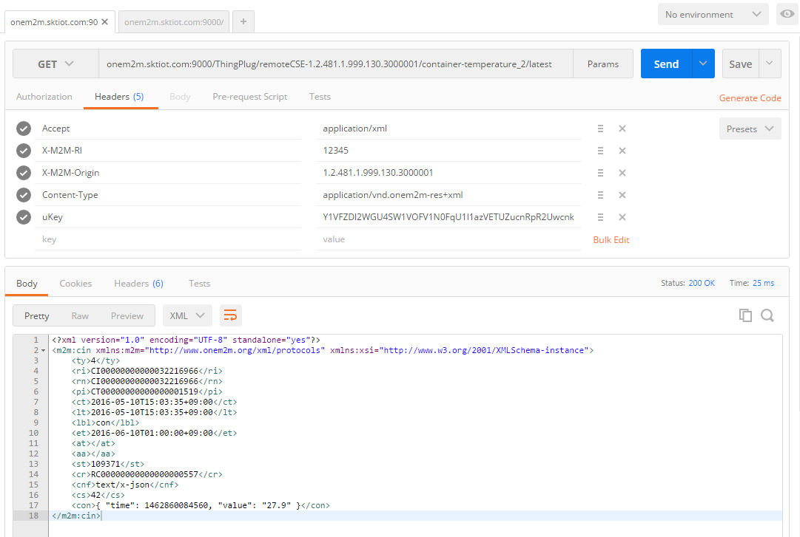
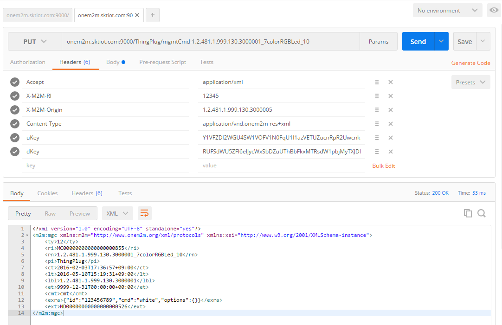

## oneM2M 등록과 주기보고 및 제어하기
본 챕터는 SKT ThingPlug Device 미들웨어를 통한 oneM2M 등록과정과 주기보고 및 제어하기에 대하여 서술한다.

#### 1. 등록과 주기보고
등록과 주기보고는 아래 그림에서 좌측부터 우측으로 진행된다.


#### 1.1. **등록**
* **nodeCreate**
  * Device로부터 node 등록을 요청받는 인터페이스.
	```xml
*   Trying 61.250.21.212...
* Connected to onem2m.sktiot.com (61.250.21.212) port 9000 (#0)
> POST /ThingPlug HTTP/1.1
Host: onem2m.sktiot.com:9000
Accept: application/xml
Content-Type: application/vnd.onem2m-res+xml;ty=14
X-M2M-RI: 744653
X-M2M-Origin: 1.2.481.1.999.130.3000005
X-M2M-NM: 1.2.481.1.999.130.3000005
Content-Length: 193
<?xml version="1.0" encoding="UTF-8"?>
<m2m:nod xmlns:m2m="http://www.onem2m.org/xml/protocols"
xmlns:xsi="http://www.w3.org/2001/XMLSchema-instance">
	<ni>1.2.481.1.999.130.3000005</ni>
</m2m:nod>

HTTP/1.1 201 Created
Server: Apache-Coyote/1.1
Set-Cookie: JSESSIONID=0939F0F442FD552733BAE20494CBA2E8; Path=/; HttpOnly
X-M2M-RI: 74465340a4f732-8d02-407a-923d-39e83a57bfe7
X-M2M-RSC: 2001
Content-Location: /ThingPlug/node-1.2.481.1.999.130.3000005
Content-Type: application/vnd.onem2m-res+xml;charset=UTF-8
Content-Length: 414
Date: Mon, 09 May 2016 07:16:56 GMT
<?xml version="1.0" encoding="UTF-8" standalone="yes"?>
<m2m:nod xmlns:m2m="http://www.onem2m.org/xml/protocols"
xmlns:xsi="http://www.w3.org/2001/XMLSchema-instance">
	<ty>14</ty>
	<ri>ND00000000000000001021</ri>
	<rn>1.2.481.1.999.130.3000005</rn>
	<pi>ThingPlug</pi>
	<ct>2016-05-09T16:16:56+09:00</ct>
	<lt>2016-05-09T16:16:56+09:00</lt>
	<lbl></lbl>
	<acpi></acpi>
	<at></at>
	<aa></aa>
	<ni>1.2.481.1.999.130.3000005</ni>
</m2m:nod>
	```

* **remoteCSECreate**
  * Device로부터 remoteCSE 등록을 요청받는 인터페이스.
	```xml
*   Trying 61.250.21.212...
* Connected to onem2m.sktiot.com (61.250.21.212) port 9000 (#0)
> POST /ThingPlug HTTP/1.1
Host: onem2m.sktiot.com:9000
Accept: application/xml
Content-Type: application/vnd.onem2m-res+xml;ty=16
X-M2M-RI: 783715
X-M2M-Origin: 1.2.481.1.999.130.3000005
passCode: ******
X-M2M-NM: 1.2.481.1.999.130.3000005
Content-Length: 292
<?xml version="1.0" encoding="UTF-8"?>
<m2m:csr xmlns:m2m="http://www.onem2m.org/xml/protocols"
xmlns:xsi="http://www.w3.org/2001/XMLSchema-instance">
	<cst>1</cst>
	<poa>MQTT|1.2.481.1.999.130.3000005</poa>
	<csi>1.2.481.1.999.130.3000005</csi>
	<rr>true</rr>
	<nl>ND00000000000000001021</nl>
</m2m:csr>

HTTP/1.1 201 Created
Server: Apache-Coyote/1.1
Set-Cookie: JSESSIONID=143E3C68954CD258653E58689949FCEA; Path=/; HttpOnly
X-M2M-RI: 78371548f298f8-a800-4d5b-bef0-fdcc732b2fd1
X-M2M-RSC: 2001
Content-Location: /ThingPlug/remoteCSE-1.2.481.1.999.130.3000005
dKey: OGs2RjJYZitiS1hqcmJjSHFNTG5hR1pQ***
Content-Type: application/vnd.onem2m-res+xml;charset=UTF-8
Content-Length: 535
Date: Mon, 09 May 2016 07:17:15 GMT
<?xml version="1.0" encoding="UTF-8" standalone="yes"?>
<m2m:csr xmlns:m2m="http://www.onem2m.org/xml/protocols"
xmlns:xsi="http://www.w3.org/2001/XMLSchema-instance">
<ty>16</ty>
<ri>RC00000000000000001050</ri>
<rn>1.2.481.1.999.130.3000005</rn>
<pi>ThingPlug</pi>
<ct>2016-05-09T16:17:14+09:00</ct>
<lt>2016-05-09T16:17:14+09:00</lt>
<lbl></lbl>
<acpi>AP00000000000000002130</acpi>
<at></at>
<aa></aa>
<cst>1</cst>
<poa>MQTT|1.2.481.1.999.130.3000005</poa>
<csi>1.2.481.1.999.130.3000005</csi>
<rr>true</rr>
<nl>ND00000000000000001021</nl>
</m2m:csr>
	```


* **containerCreate**
  * remoteCSE 등록 완료 후 Device로부터 remoteCSE GW 와 Sensor 들의 container 생성을 요청받는 인터페이스
  * 온도센서를 샘플로 함
	```xml
*   Trying 61.250.21.212...
* Connected to onem2m.sktiot.com (61.250.21.212) port 9000 (#0)
> POST /ThingPlug/remoteCSE-1.2.481.1.999.130.3000005 HTTP/1.1
Host: onem2m.sktiot.com:9000
Accept: application/xml
Content-Type: application/vnd.onem2m-res+xml;ty=3
X-M2M-RI: 804980
X-M2M-Origin: 1.2.481.1.999.130.3000005
dKey: OGs2RjJYZitiS1hqcmJjSHFNTG5hR1pQ***
X-M2M-NM: temperature_2
locale: en
Content-Length: 201
<?xml version="1.0" encoding="UTF-8"?>
<m2m:cnt xmlns:m2m="http://www.onem2m.org/xml/protocols"
xmlns:xsi="http://www.w3.org/2001/XMLSchema-instance">
<containerType>temperature</containerType>
</m2m:cnt>

HTTP/1.1 201 Created
Server: Apache-Coyote/1.1
Set-Cookie: JSESSIONID=1FF263CBE82F50D36265C0BB532EC677; Path=/; HttpOnly
X-M2M-RI: 804980d9c88ab6-48f6-4a27-b589-0571412433d9
X-M2M-RSC: 2001
Content-Location: /ThingPlug/remoteCSE-1.2.481.1.999.130.3000005/container-temperature_2
Content-Type: application/vnd.onem2m-res+xml;charset=UTF-8
Content-Length: 474
Date: Mon, 09 May 2016 07:18:01 GMT
<?xml version="1.0" encoding="UTF-8" standalone="yes"?>
<m2m:cnt xmlns:m2m="http://www.onem2m.org/xml/protocols"
xmlns:xsi="http://www.w3.org/2001/XMLSchema-instance">
	<ty>3</ty>
	<ri>CT00000000000000002299</ri>
	<rn>temperature_2</rn>
	<pi>RC00000000000000001050</pi>
	<ct>2016-05-09T16:18:01+09:00</ct>
	<lt>2016-05-09T16:18:01+09:00</lt>
	<lbl></lbl>
	<at></at>
	<aa></aa>
	<st>0</st>
	<cr>RC00000000000000001050</cr>
	<cni>0</cni>
	<cbs>0</cbs>
	<containerType>temperature</containerType>
</m2m:cnt>
	```

* **mgmtCmdCreate**
  * remoteCSE 등록 완료 후 Device로부터 remoteCSE의 mgmtCmd 등록을 요청받는 인터페이스
  * remoteCSE 등록 후 Device로부터 mgmtCmd 등록 요청을 받으면 dKey로 device에 대해 인증 성공하면 mgmtCmd를 생성한 후 생성 결과를 반환한다.
  * 7colorRGBLed를 샘플로 함
	```xml
*   Trying 61.250.21.212...
* Connected to onem2m.sktiot.com (61.250.21.212) port 9000 (#0)
> POST /ThingPlug HTTP/1.1
Host: onem2m.sktiot.com:9000
Accept: application/xml
Content-Type: application/vnd.onem2m-res+xml;ty=12
X-M2M-RI: 318239
X-M2M-Origin: 1.2.481.1.999.130.3000005
dKey: OGs2RjJYZitiS1hqcmJjSHFNTG5hR1pQ***
X-M2M-NM: 1.2.481.1.999.130.3000005_7colorRGBLed_10
locale: en
Content-Length: 276
<?xml version="1.0" encoding="UTF-8"?>
<m2m:mgc xmlns:m2m="http://www.onem2m.org/xml/protocols"
xmlns:xsi="http://www.w3.org/2001/XMLSchema-instance">
<et>9999-12-31T00:00:00+00:00</et>
<lbl>1.2.481.1.999.130.3000005</lbl>
<cmt>cmt</cmt>
<ext>ND00000000000000001021</ext>
</m2m:mgc>

HTTP/1.1 201 Created
Server: Apache-Coyote/1.1
Set-Cookie: JSESSIONID=ED19E31448D868D232B03888E384B6D1; Path=/; HttpOnly
X-M2M-RI: 318239f88fd9bb-f001-40e8-9416-a3be4c81ab58
X-M2M-RSC: 2001
Content-Location: /ThingPlug/mgmtCmd-1.2.481.1.999.130.3000005_7colorRGBLed_10
Content-Type: application/vnd.onem2m-res+xml;charset=UTF-8
Content-Length: 471
Date: Mon, 09 May 2016 07:18:15 GMT
<?xml version="1.0" encoding="UTF-8" standalone="yes"?>
<m2m:mgc xmlns:m2m="http://www.onem2m.org/xml/protocols"
xmlns:xsi="http://www.w3.org/2001/XMLSchema-instance">
<ty>12</ty>
<ri>MC00000000000000002226</ri>
<rn>1.2.481.1.999.130.3000005_7colorRGBLed_10</rn>
<pi>ThingPlug</pi>
<ct>2016-05-09T16:18:15+09:00</ct>
<lt>2016-05-09T16:18:15+09:00</lt>
<lbl>1.2.481.1.999.130.3000005</lbl>
<et>9999-12-31T00:00:00+00:00</et>
<cmt>cmt</cmt>
<ext>ND00000000000000001021</ext>
</m2m:mgc>
	```

#### 1.2. **주기보고**

* **contentInstanceCreate**
  * remoteCSE-container 등록 완료 후 Device로부터 container의 contentInstance 생성을 요청받는 인터페이스.
  * 온도센서를 샘플로 함

	```xml
*   Trying 61.250.21.212...
* Connected to onem2m.sktiot.com (61.250.21.212) port 9000 (#0)
> POST /ThingPlug/remoteCSE-1.2.481.1.999.130.3000005/container-temperature_2 HTTP/1.1
Host: onem2m.sktiot.com:9000
Accept: application/xml
Content-Type: application/vnd.onem2m-res+xml;ty=4
X-M2M-RI: 940032
X-M2M-Origin: 1.2.481.1.999.130.3000005
dKey: OGs2RjJYZitiS1hqcmJjSHFNTG5hR1pQ***
locale: en
Content-Length: 248
<?xml version="1.0" encoding="UTF-8"?>
<m2m:cin xmlns:m2m="http://www.onem2m.org/xml/protocols"
xmlns:xsi="http://www.w3.org/2001/XMLSchema-instance">
<cnf>text/x-json</cnf>
<lbl>con</lbl>
<con>{ "time": 1462778231741, "value": "27.9" }</con>
</m2m:cin>

HTTP/1.1 201 Created
Server: Apache-Coyote/1.1
Set-Cookie: JSESSIONID=ECEE6F067DEB369C360277A319EFDE83; Path=/; HttpOnly
X-M2M-RI: 9400322300d2f7-c898-4f97-afdc-6da6c2ba8ba6
X-M2M-RSC: 2001
Content-Location: /ThingPlug/remoteCSE-1.2.481.1.999.130.3000005/container-temperature_2/contentInstance-CI00000000000032145034
Content-Type: application/vnd.onem2m-res+xml;charset=UTF-8
Content-Length: 540
Date: Mon, 09 May 2016 07:18:53 GMT
<?xml version="1.0" encoding="UTF-8" standalone="yes"?>
<m2m:cin xmlns:m2m="http://www.onem2m.org/xml/protocols"
xmlns:xsi="http://www.w3.org/2001/XMLSchema-instance">
<ty>4</ty>
<ri>CI00000000000032145034</ri>
<rn>CI00000000000032145034</rn>
<pi>CT00000000000000002299</pi>
<ct>2016-05-09T16:18:53+09:00</ct>
<lt>2016-05-09T16:18:53+09:00</lt>
<lbl>con</lbl>
<et>2016-06-09T01:00:00+09:00</et>
<at></at>
<aa></aa>
<st>2</st>
<cr>RC00000000000000001050</cr>
<cnf>text/x-json</cnf>
<cs>42</cs>
<con>{ "time": 1462778231741, "value": "27.9" }</con>
</m2m:cin>
	```

#### 2. 제어 및 조회하기
다음은 actuator에 대한 제어와 제어에 대한 결과보고(sp1 방식 기준)와 Tool 을 통한 조회 및 제어 방법에 대한 설명이다.

* **제어하기**
  * 제어를 위한 actuator 는 mgmtCmd 와 함께 container 를 함께 등록한다.
  * 하나의 actuator에 대해서 command를 받을 수 있는 mgmtCmd와 더불어, command 결과를 올릴 수 있는 container를 함께 등록한다.
  * 다음은 7colorRGBLed 를 원격에서 제어할때의 요청과 결과에 대한 데이터이다.
	```xml
> PUT /ThingPlug/mgmtCmd-1.2.481.1.999.130.3000005_7colorRGBLed_10 HTTP/1.1
Host: onem2m.sktiot.com:9000
Accept: application/xml
Content-Type: application/vnd.onem2m-res+xml
X-M2M-RI: 341356
X-M2M-Origin: 1.2.481.1.999.130.3000005
dKey: OGs2RjJYZitiS1hqcmJjSHFNTG5hR1pQ***
uKey: Y1VFZDl2WGU4SW1VOFV1N0FqU1l1azVE***
<?xml version="1.0" encoding="UTF-8"?>
<m2m:mgc
xmlns:m2m="http://www.onem2m.org/xml/protocols"
xmlns:xsi="http://www.w3.org/2001/XMLSchema-instance">
<exra>{"id":"o6qscy84l","cmd":"red","options":{}}</exra>
</m2m:mgc>

HTTP/1.1 200 OK
<?xml version="1.0" encoding="UTF-8" standalone="yes" ?>
<m2m:mgcxmlns:m2m="http://www.onem2m.org/xml/protocols"
xmlns:xsi="http://www.w3.org/2001/XMLSchema-instance">
<ty>12</ty>
<ri>MC00000000000000000855</ri>
<rn>1.2.481.1.999.130.3000001_7colorRGBLed_10</rn>
<pi>ThingPlug</pi>
<ct>2016-02-03T17:36:57+09:00</ct>
<lt>2016-05-10T14:34:56+09:00</lt>
<lbl>1.2.481.1.999.130.3000001</lbl>
<et>9999-12-31T00:00:00+00:00</et>
<cmt>cmt</cmt>
<exra>{"id":"o6qscy84l","cmd":"red","options":{}}</exra>
<ext>ND00000000000000000526</ext>
</m2m:mgc>
	```

  
* **제어결과**
  * 제어 결과는 등록된 container 의 contentInstance 를 통하여 결과를 업로드 한다.
  * 다음은 7colorRGBLed를 red 색상으로 제어한 후 결과보고이다.

	```xml
> POST /ThingPlug/remoteCSE-1.2.481.1.999.130.3000005/container-7colorRGBLed_10 HTTP/1.1
Host: onem2m.sktiot.com:9000
Accept: application/xml
Content-Type: application/vnd.onem2m-res+xml;ty=4
X-M2M-RI: 341356
X-M2M-Origin: 1.2.481.1.999.130.3000005
dKey: OGs2RjJYZitiS1hqcmJjSHFNTG5hR1pQ***
locale: en
Content-Length: 248
<?xml version="1.0" encoding="UTF-8"?>
<m2m:cin xmlns:m2m="http://www.onem2m.org/xml/protocols"
xmlns:xsi="http://www.w3.org/2001/XMLSchema-instance">
<cnf>text/x-json</cnf>
<lbl>mgmt</lbl>
<con>{"id": "o6qscy84l", "result": "red"}</con>
</m2m:cin>

HTTP/1.1 201 Created
Server: Apache-Coyote/1.1
Set-Cookie: JSESSIONID=C39A2E32DECAC08FAD21982C378FE427; Path=/; HttpOnly
X-M2M-RI: 3413564d564ce1-7f3d-4908-8392-04126fb7356d
X-M2M-RSC: 2001
Content-Location: /ThingPlug/remoteCSE-1.2.481.1.999.130.3000005/container-7colorRGBLed_10/contentInstance-CI00000000000032216211
Content-Type: application/vnd.onem2m-res+xml;charset=UTF-8
Content-Length: 541
Date: Tue, 10 May 2016 05:12:14 GMT
<?xml version="1.0" encoding="UTF-8" standalone="yes"?>
<m2m:cin xmlns:m2m="http://www.onem2m.org/xml/protocols"
xmlns:xsi="http://www.w3.org/2001/XMLSchema-instance">
<ty>4</ty>
<ri>CI00000000000032216211</ri>
<rn>CI00000000000032216211</rn>
<pi>CT00000000000000001522</pi>
<ct>2016-05-10T14:12:14+09:00</ct>
<lt>2016-05-10T14:12:14+09:00</lt>
<lbl>mgmt</lbl>
<et>2016-06-10T01:00:00+09:00</et>
<at></at>
<aa></aa>
<st>47805</st>
<cr>RC00000000000000000557</cr>
<cnf>text/x-json</cnf>
<cs>38</cs><con>{"id": "o6qscy84l", "result": "red"}</con>
</m2m:cin>
	```

* **Web API testing tool 을 이용한 조회 및 제어**
  * DHC 나 Postman 등 tool 을 활용하여 조회 및 제어가 가능하다.
  * 다음은 Postman 을 이용하여 온도센서의 최신 데이터를 조회한 결과이다.
  * URL 이나 조회에 필요한 헤더 정보부분에 값이 잘못입력되는경우 404 Not Found 나 400 Bad Request 가 발생할 수 있으니 유의하자.
  * 정상 처리된 경우 우측 중앙에 200 OK 와 하단 Body 부분을 통하여 서버로부터 전달받은 센서의 시간과 온도정보를 확인할 수 있다.
  * 자세한 내용은 최신 **oneM2M 인터페이스 정의서**를 참고한다.

  * 다음은 Postman 을 이용하여 ThingPlug 서버에 7colorRGBLed actuator 의 제어를 요청한 결과이다.
  * 서버로 제어요청이 정상적으로 전달된 경우 우측 중앙에 200 OK 와 하단 Body 부분을 통하여 서버에 전달된 제어요청 내용을 확인할 수 있다.

  * 제어명령을 white 로 요청하려면 요청 Body 정보는 아래와 같은 형태로 입력하면 된다.

	```xml
<?xml version="1.0" encoding="UTF-8"?>
<m2m:mgc
xmlns:m2m="http://www.onem2m.org/xml/protocols"
xmlns:xsi="http://www.w3.org/2001/XMLSchema-instance">
<exra>{"id":"123456789","cmd":"white","options":{}}</exra>
</m2m:mgc>
	```
